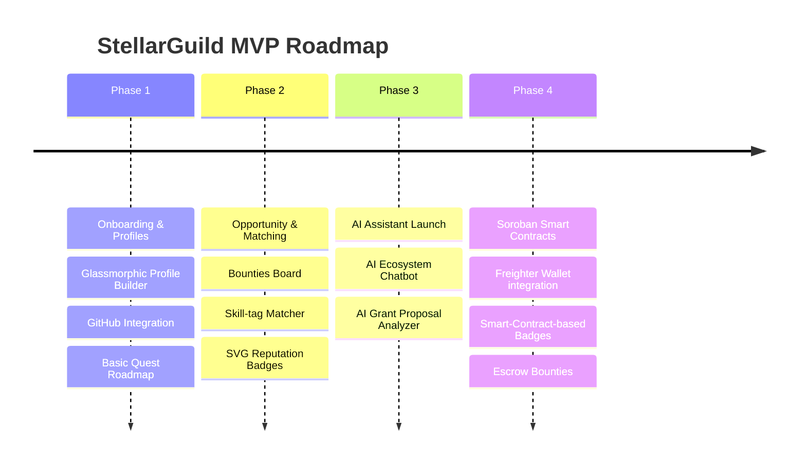

# StellarGuild 🌌
### *The Contributor Network Powering the Stellar Ecosystem*

StellarGuild is a comprehensive, AI-enhanced contributor coordination and ecosystem growth platform designed specifically for the Stellar Development Foundation (SDF) and Soroban smart contract ecosystems. 

It functions as the core coordination layer that bridges the gap between builders (developers, designers, writers, researchers, marketers) and opportunities (projects, grants, bounties, internships, and hackathons) inside the Stellar network.

---

## 🚀 The Core Vision

Most blockchain ecosystems struggle with contributor retention and project discovery. Talent is scattered across Discord, Telegram, and GitHub; grants are difficult to find and apply for; and new developers face steep onboarding curves when learning Web3 technologies like Soroban (Rust) and Stellar SDKs.

**StellarGuild solves this by becoming the unified coordination layer for the Stellar ecosystem.** It provides:
1. **Talent Discovery & Retention:** Helping Stellar projects find verified contributors instantly.
2. **Onboarding & Education:** Guiding contributors from absolute beginners to expert builders.
3. **AI-Powered Discovery:** Utilizing machine learning to match developers with appropriate grants, bounties, and projects.
4. **Verified Contribution Reputation:** Building a "Proof of Contribution" profile that replaces traditional resumes with verifiable Web3/GitHub achievements.

---

## 🎨 Interactive MVP Prototype Overview

To showcase the capability of StellarGuild, we have designed and built a **high-fidelity, premium interactive prototype**. It contains a beautiful, space-themed glassmorphic design system and includes fully operational front-end simulation for:
- **📊 Developer Dashboard:** A command center showing reputation level, completed quests, active bounties, and recommended actions.
- **💼 Opportunity Board:** Live list of bounties, issues, grants, and hackathons with real-time text searching and category filters.
- **🧠 AI Matchmaker:** An interactive matching system that evaluates a user's skills against active project requirements to calculate compatibility.
- **📖 Soroban Learning Quests:** An interactive code playground/tutorial that lets users write Rust/Soroban smart contracts, validate them, and earn badges.
- **🏆 Proof of Contribution (Leaderboard):** A community leaderboard displaying verified developers, their skills, GitHub links, and reputation scores.
- **🤖 AI Ecosystem & Grant Assistants:** Fully interactive chat interfaces to query ecosystem updates and get feedback on grant proposals.

---

## 🛠 Core Features

### 1. Proof of Contribution (Contributor Profiles)
An ecosystem-wide profile highlighting skills, GitHub activity, completed Stellar/Soroban quests, and verified grants. 
* **Ecosystem Trust Score:** Calculated based on successful bounty delivery, open-source commits, and peer reviews.
* **Badges:** Smart-contract-issued non-transferable achievement tokens representing verified milestones (e.g., "Soroban Pioneer", "Bounty Slayer").

### 2. Opportunity Board ("The Jobs Board for Stellar")
A centralized hub for projects to recruit builders. Includes:
* **Bounties:** Developer issues with micro-payouts.
* **Grants:** Direct links to SDF Wave programs and local incubation tracks.
* **Paid Tasks & Internships:** Traditional roles for growing startups in the ecosystem.

### 3. AI Contributor Matchmaking
Matches builders to projects using intelligent embedding models. 
* *Example:* A Soroban project requires a Rust developer with frontend React experience. StellarGuild's matcher identifies contributors with matching quest records and GitHub histories, ranking them based on relevance.

### 4. Soroban Learning Hub & Quests
A gamified developer journey. Users:
* Learn Stellar basics, transaction logic, and asset issuing.
* Write Soroban smart contracts directly in an interactive sandbox.
* Complete tasks, submit solutions for automatic linting/validation, and level up.

### 5. Reputation & Achievement System
Every contribution (merged PR, resolved bounty, completed tutorial) is logged on-chain (or simulated via decentralized databases) to create an immutable reputation passport.

### 6. Dual AI Assistants
* **AI Ecosystem Assistant:** Quickly answer developer queries ("What is the latest Soroban CLI version?", "Show me active hackathons").
* **AI Grant Assistant:** Helps teams draft, structure, and refine their proposals to meet SDF guidelines, creating technical roadmaps and milestones.

---

## 💻 Recommended Technology Stack

| Layer | Technology | Purpose |
| :--- | :--- | :--- |
| **Frontend** | React, Next.js, TailwindCSS, Framer Motion | Dynamic, fluid, and responsive builder dashboard. |
| **Backend** | Node.js (NestJS) or Go | Scalable microservices for processing profile and opportunity data. |
| **Database** | PostgreSQL + pgvector | Relational data storing alongside vector embeddings for matchmaking. |
| **AI Layer** | Python, OpenAI API, LangChain | Matchmaking algorithms, proposal analyzers, and chatbot agents. |
| **Web3 Layer** | Stellar SDK, Soroban CLI, Freighter Wallet | Smart contracts for reputation badges, bounty escrow, and gasless rewards. |

---

## ⚡ MVP Road Map (Aggressive & Practical)



* **Phase 1: Foundation (Weeks 1-4):** Focus on Contributor Profiles, GitHub sync, and the initial Soroban Learning Quests.
* **Phase 2: Marketplace (Weeks 5-8):** Roll out the Opportunities Board and the AI Matchmaker algorithm (using text embeddings).
* **Phase 3: Intelligence (Weeks 9-12):** Deploy the AI Assistants (Ecosystem Chat & Grant Proposal Optimizer).
* **Phase 4: Decentralization (Weeks 13+):** Integrate Freighter Wallet for on-chain badge issuance and bounty payouts using Soroban smart contracts.

---

## 📦 How to Run the Prototype

The interactive prototype is located in this directory. It is built using clean, responsive HTML5, modern CSS3 (featuring glassmorphism, responsive grids, and animations), and custom JavaScript to handle real interactive behaviors (no frameworks required for setup).

### Option A: Local Dev Server (Recommended)
You can serve the directory using a simple HTTP server:
```bash
# Using Node's serve
npm install -g serve
serve .

# Or using Python's built-in server
python3 -m http.server 8080
```
Then open `http://localhost:8080` in your web browser.

### Option B: Direct File Open
You can open `index.html` directly in any modern browser (Chrome, Firefox, Safari, Edge):
```bash
xdg-open index.html  # Linux
open index.html      # macOS
```

---

## 🌟 Grant Positioning for SDF

StellarGuild is proposed as a **Core Ecosystem Infrastructure Tool** under the **SDF Waves Program**. It represents a powerful force multiplier for every dollar spent by SDF:
1. **Reduces Developer Friction:** Keeps hackathon participants engaged *after* the event concludes.
2. **Improves Capital Efficiency:** Helps SDF evaluate grant candidates by checking their verified on-chain history.
3. **Empowers Local Chapters:** Provides localized communities in emerging markets (Africa, Latin America, Southeast Asia) with a structured playbook and platform to host contributor sprints.
